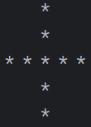

# **JAVA ASSIGNMENT**
# **07 Loops**
## Exercise:
### <p>1.What is the purpose of a break statement in Java?<P>
    a.To skip the current iteration of a loop.
    b.To terminate the loop and resume execution after the loop
    c.To pause the loop temporarily
    d.To execute the loop infinitely
### <p>2.Which statement is used to skip the current iteration in a loop and continue  with the next iteration?<p>
    a.skip
    b.continue
    c.next
    d.pass
### <P>3.What happens if you mistakenly create an infinite loop in Java?<p>
    a.The program crashes with an error message
    b.Java automatically detects and stops the loop after a certain time
    c.The loop continues to execute infinitely
    d.The loop executes once and then stops
### <P>4.Which loop type is best suited when the number of iterations is known beforehand?<P>
    a.for loop
    b.while loop
    c.do-while loop
### <p>5.What will be the output of the code below?<P>


    a.0 1 2
    b.0 1 2 3
    c.0 1 2 3 4
    d.0 1 2 3 4 5
### <P>6.Explain the following loops with code examples?<P>
    a.while loop
    b.do-while loop
    c.for loop

### <p>7.What is the Fibonacci series? Write code to print it.<p>
### <p>8.What is a Harshad or divine number? Write code to find whether the given number is a Harshad.<p>
### <P>9.Print the following patterns.<p>
 

## Answers:
### <p>1. b.To terminate the loop and resume execution after the loop.<p>
### <p>2. b.Continue.<P>
### <p>3. c.The loop continues to execute infinitely.<P>
### <p>4. a.for loop.<p>
### <P>5. a.0 1 2<P>
### <P>6. 
### <p>a.while loop<p>
#### <p>A while loop repeatedly executes a block of code as long as a condition is true. It's useful when you don't know in advance how many times to repeat a task.<P>
### <p>Example:<P>
```
public class AssignmentSeven {
    public static void main(String[] args) {
        int i= 1;
        while (i <= 8){
            System.out.println(i);
            i++;
        }
    
    }
}
```
### <p>b.do-While loop<P>
#### <p>A do-while loop is a control flow statement that executes a block of code at least once, and then repeats the execution as long as the given condition is true.<p>
### <p>Example:<p>
```
public class AssignmentSeven {
    public static void main(String[] args) {
        int i= 1;
        do{
            System.out.println(i);
            i++;
        }while(i<=10);
    
    }
}
```
### <p>c.for loop<p>
#### <p>A for loop is used when you know in advance how many times you want to execute a block of code. It includes initialization, condition checking, and update—all in one line.<p>
### <p>Example:<p>
```
public class AssignmentSeven {
    public static void main(String[] args) {
       for(int i=1;i<=8;i++){
        System.out.println(i);
       }
    
    }
}
```
### <p>7.The Fibonacci series follows the same logic as in other languages: each term is the sum of the two preceding terms, starting with 0 and 1.<P>
### <p>Example:<P>
```
public class AssignmentSeven {
    public static void main(String[] args) {
        int N = 10;
        int n1 = 0,n2 = 1;
           
            for(int i=0;i<10;i++){
        System.out.println(n1);
        int n3 = n2 + n1;
        n1 = n2;
        n2 = n3;
       }
    
    }
}
```
### <p>8.A Harshad number (also called a Divine number) is an integer that is divisible by the sum of its digits.<p>
### <p>Example:<p>
```
public class AssignmentSeven {
    public static void main(String[] args) {
        int n = 126;
        int OriginalNumber= n;
        int SumofDigits = 0;
        if(n==0){
            System.out.println(0);
        }
         while(n>0){
            int SingleDigitofn = n%10;
            SumofDigits += SingleDigitofn ;
            n/=10;
         } 
         System.out.println(SumofDigits); 
         if(OriginalNumber%SumofDigits==0){
            System.out.println("Harshad Number");
         }else{
            System.out.println("Not Harshad Number");
         }
        
    }
}
```
### <p>9.Patterns<p>
### 1.
```
public class AssignmentSeven {
    public static void main(String[] args) {
        int n = 5;
        for(int i = 1;i<=5;i++){
            for(int j = 1;j<=5;j++){
            System.out.print("*" + " ");
        }
        System.out.println();
    }
    }
}
```
### 2.
```
public class AssignmentSeven {
    public static void main(String[] args) {
        int n = 5;
        for(int i = 1;i<=n;i++){
            for(int j = 1;j<=i;j++){
            System.out.print("*" + " ");
        }
        System.out.println();
    }
    }
}
```
### 3.
```
public class AssignmentSeven {
    public static void main(String[] args) {
        int n = 5;
        for(int i = 1; i<=5; i++){
            for(int k = 1; k<=n-i;k++){
                System.out.print(" ");
            }
            for(int j = 1; j<=i; j++){
                System.out.print("*");
            }
            System.out.println();
        }
    }
}
```
### 4.
```
public class AssignmentSeven {
    public static void main(String[] args) {
        int n = 5;
        for(int i=1; i<=n; i++){
            for(int j=1; j<=n; j++){
                if(i==1 || i==n || j==1 || j==n){
                    System.out.print("* ");
                }else{
                    System.out.print(" " + " ");
                }
            }
            System.out.println();
        }
    }
}
```
### 5.
```
public class AssignmentSeven {
    public static void main(String[] args) {
        int n = 5;
        for(int i=1; i<=n; i++){
            for(int j=i; j<n; j++){
                System.out.print(" ");
            }
            for(int k=1; k<=2*i-1; k++){
                System.out.print("*");
            }
            System.out.println();
        }
    }
}
```
### 6.
```
public class AssignmentSeven {
    public static void main(String[] args) {
       int n =5;
       for(int i=1; i<=n; i++){
        for(int k=1; k<=i-1; k++){
            System.out.print(" ");
        }
        for(int j=1; j<=n+1-i; j++){
            System.out.print("*");
        }
        System.out.println();
       }
    }
}
```
### 7.
```
public class AssignmentSeven {
    public static void main(String[] args) {
                int n = 5;
                for(int i=n; i>=1; i--){
                    for(int j=i; j<n; j++){
                        System.out.print(" ");
                    }
                    for(int k=1; k<=2*i-1; k++){
                        System.out.print("*");
                    }
                    System.out.println();
                }
            }
        }
```
### 8.
```
public class AssignmentSeven {
    public static void main(String[] args) {
                int n = 5;
                for(int i=1; i<=n; i++){
                    for(int j=i; j<=n; j++){
                        System.out.print(" ");
                    }
                    for(int k=1; k<=n-1; k++){
                        System.out.print("* ");
                    }
                    System.out.println();
                }
            }
        }    
```     
### 9.
```
public class AssignmentSeven {
    public static void main(String[] args) {
                int n = 5;
                for(int i=0; i<n; i++){
                    for(int j=0; j<i; j++){
                        System.out.print(" ");
                    }
                    for(int k=0; k<n; k++){
                        System.out.print("* ");
                    }
                    System.out.println();
                }
            }
        }         
```
### 10.
```
public class AssignmentSeven {
    public static void main(String[] args) {
                int n = 5;
                for(int i=1; i<=n; i++){
                    for(int j=1; j<i; j++){
                        System.out.print(" ");
                    }
                    System.out.println("*");
                }
            }
        }    
```
### 11.
```
public class AssignmentSeven {
    public static void main(String[] args) {
                int n = 5;
                for(int i=1; i<=n; i++){
                    for(int j=i; j<n; j++){
                        System.out.print(" ");
                    }
                    System.out.println("*");
                }
            }
        } 
```
### 12.
```
public class AssignmentSeven {
    public static void main(String[] args) {
                int n = 5;
                for(int i=0; i<n; i++){
                    for(int j=0; j<n; j++){
                        if(i==j || i+j==n-1){
                            System.out.print("*");
                        }else{
                        System.out.print(" ");
                    }
                }
                System.out.println();
            } 
        }
    }
```           
### 13.
```
public class AssignmentSeven {
    public static void main(String[] args) {
                int n = 5;
                for(int i=0; i<n; i++){
                            System.out.print("*");
                        }
                System.out.println();
            } 
        }
```          
### 14.
```
public class AssignmentSeven {
    public static void main(String[] args) {
                int n = 5;
                for(int i=0; i<n; i++){
                            System.out.println("*");
                        }
            } 
        }
```
### 15.
```
public class AssignmentSeven {
    public static void main(String[] args) {
                int n = 5;
                for(int i=0; i<n; i++){
                    for(int j=0; j<n; j++){
                        if(i==n/2 || j==n/2){
                        System.out.print("*");
                }else{
                System.out.print(" ");
                }
            }
                System.out.println();
            } 
        }
    } 
```
### 16.
```
public class AssignmentSeven {
    public static void main(String[] args) {
                int n = 5;
                for(int i=0; i<n; i++){
                    for(int j=0; j<n; j++){
                        if(i==0 || i == n-1){
                        System.out.print("*");
                }else{
                System.out.print(" ");
                }
            }
                System.out.println();
            } 
        }
    } 
```

[githublink]()
          


